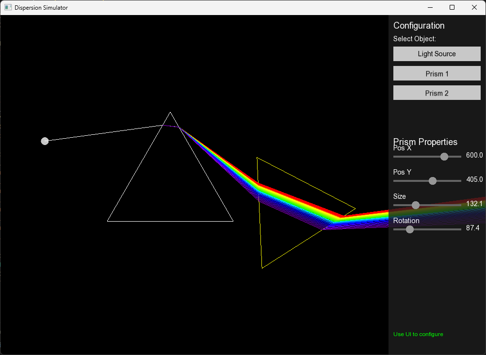

<p align="center">
  
</p>

<h1 align="center">Broken Glass</h1>
<h3 align="center">Optical Dispersion Simulator built with SFML</h3>

<p align="center">


<a href="LICENSE"></a>
</p>

Broken Glass is a highly interactive, physics-based optical dispersion simulator. Built with modern C++20 and SFML 3.0.2, it visualizes how light refracts and disperses through prisms, demonstrating phenomena like the splitting of white light into its spectral colors.

### Contents

- [About](#about)
- [Features](#features)
- [Controls](#controls)
- [Tech Stack](#tech-stack)
- [Build](#build)
- [License](#license)

## About

**Type:** Physics Simulator  
**Visual Style:** Geometric / Scientific Visualization

**Core Concepts:**
Refraction is simulated using **Snell's Law**, while dispersion is approximated using the **Cauchy equation**, which relates the refractive index to the wavelength of light. This allows the simulation to accurately split a single "white" light beam into a rainbow of component rays as they pass through optical elements.

**Simulation Features:**
- Ray tracing with support for multiple internal reflections
- Wavelength-dependent refractive indices
- Real-time interaction with optical elements

## Features

- 🔦 **Interactive Light Sources**: Move and rotate light sources to see how rays interact with the scene.
- 🔺 **Configurable Prisms**: Adjust position, size, and rotation of equilateral prisms.
- 🌈 **Realistic Dispersion**: Visualizes the separation of light into spectral colors (Red to Violet).
- 🖱️ **Integrated UI**: Custom-built immediate mode UI for easy property manipulation.
- ⚡ **Real-time Rendering**: Instant feedback as you manipulate the scene.

## Controls

The simulation uses a mouse-driven interface.

| Interaction | Action |
|-------------|--------|
| **Left Click** | Interact with UI sliders and buttons |
| **Hover** | Highlight UI elements |
| **Side Panel** | Select objects (Light Source, Prisms) to view and edit their properties |

### Object Properties
Select an object from the list to modify:
- **Position (X, Y)**: Move the object in the 2D plane.
- **Rotation**: Rotate the prism or light source direction.
- **Size**: Scale the prisms.

## Tech Stack

| Category | Tool |
|----------|------|
| Standard | C++20 |
| IDE | Visual Studio Code |
| Build System | CMake |
| Library | SFML 3.0.2 |
| Platform | Windows x64 |
| Version Control | Git, GitHub |

## Build

### Prerequisites

- **C++20** compatible compiler (e.g., MSVC)
- **CMake** 3.21+
- **SFML 3.0.2** installed

### Windows (Visual Studio)

```shell
mkdir build && cd build
cmake ..
cmake --build . --config Release
```

The executable will be generated in the `build` folder. Make sure to copy the `assets` folder (if applicable) or ensure resources are available.

## License

This project is licensed under the **MIT License**. See [LICENSE](LICENSE) for full details.